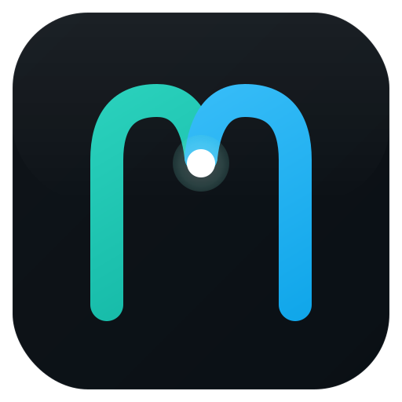
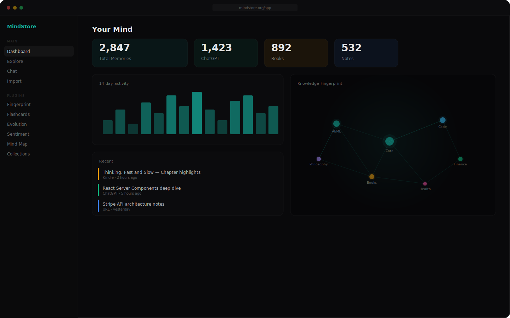

<div align="center">
  <a href="https://mindstore.org">
    
  </a>
  <h3>Your knowledge, portable to any AI.</h3>
  <p>Import everything you've ever read, written, or saved. Search by meaning. Connect to any AI via MCP.</p>

  <br />

  <a href="https://mindstore.org"><strong>Website</strong></a> · <a href="https://mindstore.org/docs"><strong>Docs</strong></a> · <a href="https://github.com/WarriorSushi/mindstore/issues"><strong>Issues</strong></a> · <a href="#roadmap"><strong>Roadmap</strong></a> · <a href="https://discord.gg/altcorp"><strong>Discord</strong></a>

  <br />
  <br />

  [](LICENSE)
  [](#)
  [](#plugins)
  [](https://modelcontextprotocol.io)
  [](https://vercel.com/new/clone?repository-url=https://github.com/WarriorSushi/mindstore)

  <br />
  <br />

  
</div>

<br />

## Why MindStore

Every AI starts from zero. Your ChatGPT doesn't know what you told Claude. Your Copilot doesn't know your Kindle highlights. Your knowledge is scattered across 15 apps and none of them talk to each other.

MindStore imports everything into one searchable knowledge base — then connects it to **any AI** through [MCP](https://modelcontextprotocol.io), the open protocol.

**You bring the AI access.** MindStore stores, retrieves, and exposes your knowledge; you can use your own provider keys or local models.

<br />

## Features

<table>
<tr>
<td width="50%">

### 🔍 Semantic Search
BM25 + vector hybrid search with HyDE query expansion, reranking, and contextual compression. Find anything by meaning, not just keywords.

### 💬 Chat With Your Knowledge
Ask questions, get cited answers from YOUR data. Switch AI models per-message. Works with OpenAI, Gemini, OpenRouter, Ollama, or any OpenAI-compatible endpoint.

### 🧬 Knowledge Fingerprint
3D WebGL visualization of your mind's topology. See clusters, connections, blind spots — rendered as an interactive graph.

</td>
<td width="50%">

### ⚡ 35 Plugins
Flashcard engine (SM-2), contradiction finder, topic evolution timeline, sentiment analysis, mind maps, blog/newsletter generation, voice-to-memory, and more.

### 🌐 MCP Protocol
Three functions. Any AI gets your brain. Works with Claude, Cursor, Windsurf, Copilot — anything that speaks MCP.

### 📦 12+ Importers
ChatGPT exports, Kindle highlights, YouTube transcripts, Obsidian vaults, Notion, Reddit, PDFs, voice memos, images, URLs, and more.

</td>
</tr>
</table>

<br />

## Quick Start

### One-click deploy

[](https://vercel.com/new/clone?repository-url=https://github.com/WarriorSushi/mindstore)

### Self-host

```bash
git clone https://github.com/WarriorSushi/mindstore.git
cd mindstore
cp .env.example .env.local
npm install
npm run migrate
npm run dev
```

For a public multi-user deployment, configure Google OAuth and set `ALLOW_SINGLE_USER_MODE=false`.

### Requirements

- **Node.js** 20+
- **PostgreSQL** with [pgvector](https://github.com/pgvector/pgvector) extension
- **Supabase is optional** — any managed or self-hosted Postgres works
- **AI provider access** for semantic search, chat, and AI-heavy plugins

<br />

## Connect Your AI

Add MindStore as a tool in any MCP-compatible AI:

```json
{
  "mcpServers": {
    "mindstore": {
      "url": "https://your-instance.com/api/mcp"
    }
  }
}
```

Three functions are exposed:

| Function | Description |
|----------|-------------|
| `search_mind` | Semantic search across all your knowledge |
| `get_profile` | Your expertise areas, writing style, stats |
| `get_context` | Deep context on any topic from your knowledge |

Works with **Claude Desktop**, **Cursor**, **Windsurf**, **GitHub Copilot**, and any MCP client.

<br />

## Plugins

MindStore ships a broad plugin catalog across import, analysis, action, sync, and AI enhancement workflows. Plugin maturity still varies by feature and deployment mode.

| Category | Plugins |
|----------|---------|
| **Import** | ChatGPT, Kindle, YouTube Transcript, Notion, Obsidian, Reddit, PDF/EPUB, Twitter, Telegram, Pocket, Readwise, Browser Bookmarks |
| **Analysis** | Knowledge Fingerprint, Contradiction Finder, Topic Evolution, Sentiment Timeline, Knowledge Gaps, Writing Style |
| **Action** | Flashcard Engine, Mind Map, Smart Collections, Blog Draft, Newsletter Writer, Resume Builder |
| **AI** | Custom RAG, Domain Embeddings, Multi-Language, Conversation Prep, Learning Paths |
| **Export** | Anki Export, Markdown Blog, Notion Sync, Obsidian Sync |
| **Capture** | Voice-to-Memory, Image-to-Memory, Spotify History |

<br />

## Architecture

```
┌──────────────────────────────────────────────────────────┐
│                        Client                            │
│   Next.js 16 · React 19 · Tailwind · Plus Jakarta Sans  │
├──────────────────────────────────────────────────────────┤
│                      API Layer                           │
│           66 routes · NextAuth · MCP Server              │
├──────────────────────────────────────────────────────────┤
│                    Plugin System                         │
│       35 plugins · Shared AI Client · Job Queue          │
├──────────────────────────────────────────────────────────┤
│                      Data Layer                          │
│     PostgreSQL · pgvector · BM25 · Drizzle ORM           │
├──────────────────────────────────────────────────────────┤
│                    AI Providers                           │
│   OpenAI · Gemini · Ollama · OpenRouter · Custom API     │
└──────────────────────────────────────────────────────────┘
```

- **No AI costs for MindStore** — users bring their own keys
- **Embeddings** — multi-provider (Gemini, OpenAI, Ollama)
- **Search** — hybrid BM25 + cosine similarity with HyDE
- **Auth** — Google OAuth via NextAuth for multi-user installs, optional single-user fallback for private/self-hosted setups

<br />

## Roadmap

- [x] Broad plugin catalog spanning import, analysis, action, sync, and AI enhancement
- [x] MCP server — connect any AI
- [x] 12+ importers — ChatGPT, Kindle, YouTube, Obsidian, etc.
- [x] Hybrid semantic search — BM25 + vector
- [x] Chat with cited answers
- [x] Knowledge Fingerprint — 3D visualization
- [x] Plugin store with categories
- [x] PWA support
- [ ] `.mind` file format — portable knowledge files
- [ ] Community knowledge bases — share, browse, import, merge
- [x] Onboarding wizard
- [x] Demo mode with sample data
- [ ] Team workspaces

<br />

## Contributing

We welcome contributions! See [CONTRIBUTING.md](CONTRIBUTING.md) for guidelines.

```bash
# Development
npm run dev          # Start dev server on the default Next.js port (3000)
npm run migrate      # Apply database migrations
npm run test         # Run unit tests
npm run build        # Production build
npm run typecheck    # Type checking
npm run lint:ci      # Stabilized CI lint slice
npm run lint:backlog # Wider repo lint backlog
```

All commits require [DCO sign-off](https://developercertificate.org/):
```bash
git commit -s -m "your message"
```

<br />

## License

MindStore is licensed under the [Functional Source License, Version 1.1, MIT Future License (FSL-1.1-MIT)](LICENSE).

**What this means:**

- ✅ **Free to self-host** — personal, company, education, any size
- ✅ **Free to modify** — change anything, build plugins, customize
- ✅ **Free to redistribute** — share copies with the license included
- ✅ **Source available** — read, audit, and learn from all code
- ✅ **Converts to MIT** — each version becomes fully MIT after 2 years
- ❌ **No competing service** — you can't offer MindStore as a hosted product that competes with us

<br />

<div align="center">
  <a href="https://mindstore.org">
    
  </a>
  <br />
  <sub>Built with conviction, not just code.</sub>
</div>
